# 📊 Retail Sales Analytics — End-to-End Data Analytics Project

## 📌 Project Overview

This is an end-to-end retail sales analytics project covering the complete data analytics workflow — from data preparation and cleaning to analysis, visualization, and dashboard development.

The project uses **Excel, SQL, Python, and Power BI** together to analyze retail sales data and present the results through an interactive dashboard.

## 🎯 Project Objective

The objective of this project is to clean and analyze retail sales data, identify useful patterns and trends, and present the findings through structured analysis and an interactive Power BI dashboard.

## 🔄 Project Workflow

**Data → Excel → SQL → Python → Power BI → Business Insights**

1. Data preparation and cleaning
2. Excel analysis
3. SQL database analysis
4. Python data analysis and exploratory analysis
5. Power BI dashboard development
6. Business insights
7. Final dashboard presentation

## 🔗 How the Tools Work Together

The same cleaned retail sales dataset was used throughout the project to maintain consistency across the different stages.

* **Excel** was used for data cleaning, KPI calculations, and pivot table analysis.
* **SQL (PostgreSQL)** was used for database setup and structured analysis of sales, profit, categories, regions, products, customers, and other fields.
* **Python (Google Colab)** was used for data validation, exploratory analysis, visualizations, and correlation analysis.
* **Power BI** was used to combine the analysis into an interactive 3-page dashboard.

## 🛠️ Tools & Technologies

* Microsoft Excel
* PostgreSQL
* SQL
* Visual Studio Code
* Python
* Google Colab
* Pandas
* NumPy
* Matplotlib
* Seaborn
* Power BI

## 📁 Dataset

The project uses a cleaned retail sales dataset containing order, customer, product, sales, profit, discount, region, and payment information.

### Key Fields

* Order ID
* Order Date
* Ship Date
* Customer ID
* Customer Name
* Gender
* Age
* Category
* Sub-Category
* Product ID
* Product Name
* Quantity
* Unit Price
* Sales
* Profit
* Discount
* Region
* State
* City
* Payment Method

### 📌 Derived Metrics

* Total Orders
* Total Sales
* Total Profit
* Total Quantity
* Average Order Value

## 🧹 Data Cleaning & Preparation

The dataset was cleaned and prepared before starting the analysis.

The cleaning process included:

* Removing duplicate and unwanted records
* Handling missing values
* Replacing missing City and Customer Name values with **"Unknown"** where required
* Preparing date fields for analysis
* Validating important dataset fields
* Preparing the cleaned dataset for use across Excel, SQL, Python, and Power BI

The cleaned dataset was then used consistently throughout the project.

## 📗 Excel Analysis

The Excel stage was used for data cleaning, KPI calculations, basic analysis, and pivot table analysis.

### 📊 Excel Work Included

* Data cleaning
* Removing duplicates and unwanted records
* Handling missing values
* KPI calculations
* Pivot table analysis

### 📌 Key KPIs

* Total Orders
* Total Sales
* Total Profit
* Average Order Value
* Average Profit
* Total Quantity Sold

### 📊 Pivot Table Analysis

The following pivot tables were created:

* Sales by Category
* Sales by Region
* Profit by Category
* Top 10 Products by Sales
* Top 10 Customers by Sales

### 🖼️ Excel Analysis Preview

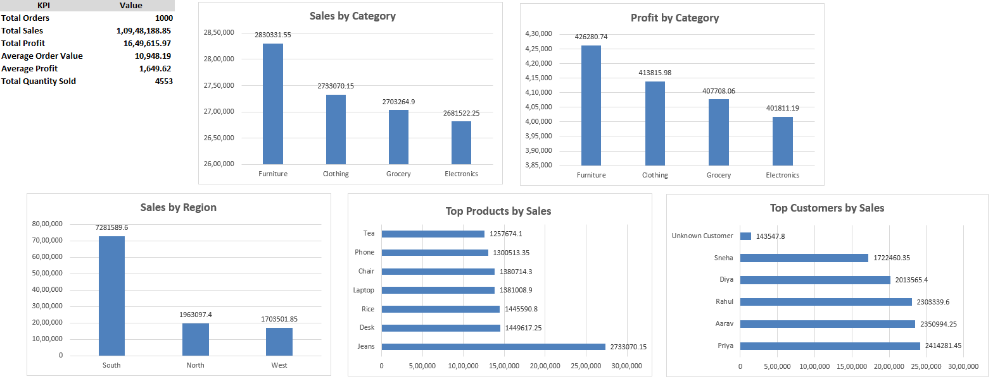

The Excel analysis provided the initial structured view of the cleaned retail sales data before continuing with SQL, Python, and Power BI.

## 🗄️ SQL Analysis

SQL analysis was carried out using **PostgreSQL** and **Visual Studio Code**.

### 🔧 SQL Work Included

* Database setup
* Table creation
* Importing the cleaned retail sales data
* Aggregate functions
* `GROUP BY` and `HAVING`
* `ORDER BY` and `LIMIT`
* Sales analysis
* Profit analysis
* Category analysis
* Region analysis
* Top 10 product analysis
* Top 10 customer analysis
* Monthly sales and profit analysis
* Payment method analysis
* Gender analysis
* Discount analysis
* Profit margin analysis

### 📄 SQL Files

The SQL work is organized into:

* `01_Database_Setup`
* `02_Create_Table`
* `03_Analyze_Queries`

### 📸 SQL Analysis Screenshots

#### Overall KPI

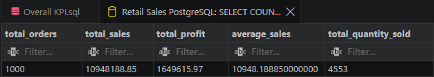

#### Category Performance

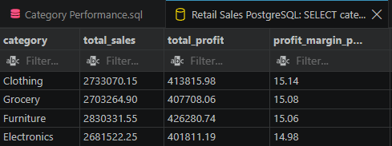

#### Monthly Sales Trend

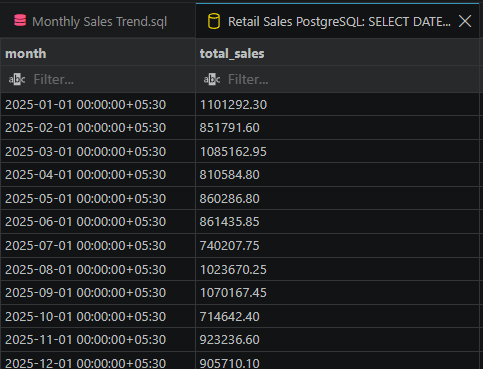

#### Regional Sales

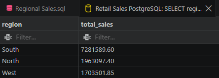

#### Top 10 Customers

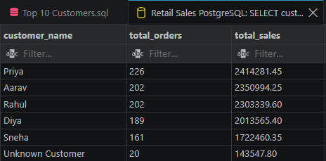

#### Top 10 Products

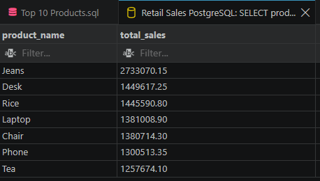

## 🐍 Python Analysis

Python analysis was carried out in **Google Colab** using Pandas, NumPy, Matplotlib, and Seaborn.

### 🔍 Data Cleaning & Validation

The Python workflow included:

* Preparing date columns
* Checking duplicate records
* Validating important dataset fields
* Preparing the cleaned data for analysis

### 📊 Exploratory Data Analysis

The analysis included:

* Descriptive statistics
* Categorical data analysis
* Category analysis
* Region analysis
* Payment Method analysis
* Sales analysis
* Profit analysis
* Quantity analysis
* Average sales analysis
* Top 10 Products analysis
* Top 10 Customers analysis
* Monthly Sales analysis
* Monthly Profit analysis

### 📈 Data Visualization

The Python analysis included:

* Sales by Category
* Monthly Sales Trend
* Profit by Category
* Sales by Region
* Correlation Heatmap

### 🔗 Correlation Analysis

Correlation analysis was performed on selected numerical variables:

* Age
* Quantity
* Unit Price
* Discount
* Sales
* Profit

Additional analysis was performed for payment method and gender.

### 📸 Python Analysis Screenshots

#### Data Cleaning & Validation

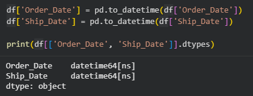

#### Sales & Profit Analysis

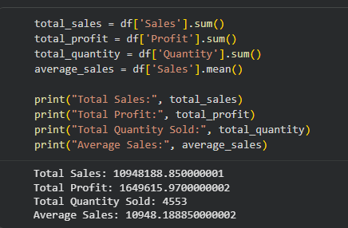

#### Monthly Sales Trend

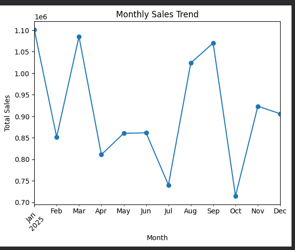

#### Sales by Category

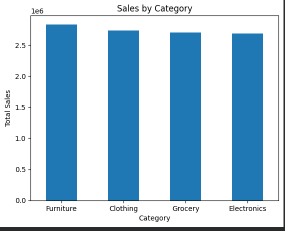

#### Correlation Heatmap

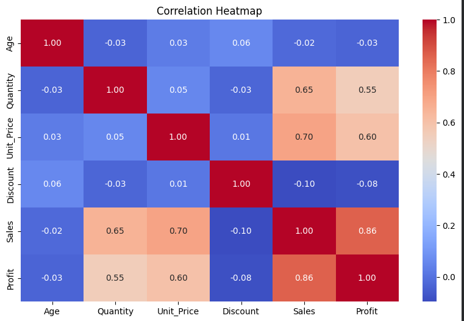

## 📊 Power BI Dashboard

The final stage of the project was the development of an interactive **3-page Power BI dashboard**.

**Power BI File:** `Retail Sales Analytics Dashboard.pbix`

### 📌 Dashboard Pages

### 1️⃣ Overview

The Overview page provides a high-level summary of the retail sales analysis.

It includes:

* Total Sales
* Total Profit
* Total Quantity
* Total Orders
* Average Order Value
* Category analysis
* Regional analysis
* Payment Method analysis
* Product analysis
* Slicers
* Clear Filters button
* Navigation buttons

### 2️⃣ Sales & Trend Analysis

This page focuses on sales, profit, and trend analysis.

It includes:

* Monthly Sales Trend
* Monthly Profit Trend
* Sales and Profit by Category
* Sales and Profit by Region
* Sales by Sub-Category
* Profit by Sub-Category
* Clear Filters button
* Navigation buttons

### 3️⃣ Product, Customer & Business Insights

This page focuses on product, customer, and additional business analysis.

It includes:

* Top 10 Customers by Sales
* Top 10 Products by Sales
* Sales by Payment Method
* Sales by Gender
* Age vs Quantity analysis
* Business Insights
* Regional Performance
* Category Performance
* Top Product
* Payment Behavior
* Clear Filters button
* Navigation buttons

### 🖼️ Dashboard Preview

#### 1️⃣ Overview


#### 2️⃣ Sales & Trend Analysis


#### 3️⃣ Product, Customer & Business Insights


## 📁 Project Structure

```text
Retail Sales Analytics Dashboard/
│
├── Data/
│   ├── Retail Sales Cleaned
│   └── Retail Sales Cleaned Sheet
│
├── Excel/
│   ├── Retail Sales Analytics
│   ├── Retail Sales Analytics Raw Data - Realistic
│   └── excel_analysis.png
│
├── PowerBI/
│   ├── Retail Sales Analytics Dashboard.pbix
│   ├── Assets/
│   └── Images/
│       ├── powerbi_overview.png
│       ├── powerbi_sales_trends.png
│       └── powerbi_product_customer_insights.png
│
├── Python/
│   ├── Retail Sales Analytics Python
│   └── Images/
│       ├── 01_data_cleaning_validation.png
│       ├── 02_sales_profit_analysis.png
│       ├── 03_monthly_sales_trend.png
│       ├── 04_sales_by_category.png
│       └── 05_correlation_heatmap.png
│
└── SQL/
    ├── VS Code/
    │   ├── 01_Database_Setup.sql
    │   ├── 02_Create_Table.sql
    │   └── 03_Analyze_Queries.sql
    │
    └── Images/
        ├── category_performance.png
        ├── monthly_sales_trend.png
        ├── overall_kpi.png
        ├── regional_sales.png
        ├── top_10_customers.png
        └── top_10_products.png
```

---

## 💡 Key Business Insights

The analysis performed across Excel, SQL, Python, and Power BI helped identify the following key business areas:

### 🌍 Regional Performance

Sales and profit were analyzed across different regions to understand regional differences in overall performance.

### 📦 Category Performance

Category-level analysis was used to compare sales and profit performance and identify stronger-performing categories.

### 🏆 Top Products & Customers

Top products and customers were identified based on sales performance to understand major contributors to overall sales.

### 💳 Payment Behavior

Payment methods were analyzed to understand how sales were distributed across different payment types.

These insights were brought together in the Power BI dashboard for easier exploration and comparison.

---

## 🎯 Conclusion

This project demonstrates a complete end-to-end data analytics workflow using Excel, SQL, Python, and Power BI.

The retail sales dataset was prepared and cleaned first, followed by analysis in Excel and PostgreSQL. Python was then used for data validation, exploratory analysis, correlation analysis, and visualization. Finally, Power BI was used to bring the key findings together in an interactive 3-page dashboard.

The project demonstrates how multiple data analytics tools can be used together to transform raw retail sales data into structured analysis, visual insights, and an interactive business dashboard.

---

## 🚀 Future Improvements

The project can be extended in the future with:

* Automated data refresh
* Advanced sales forecasting
* Customer segmentation
* More detailed time-based analysis
* Additional dashboard interactivity

---

## 👤 Author

**Ansila**

**Project:** Retail Sales Analytics — End-to-End Data Analytics Project

**Tools:** Excel • SQL • Python • Power BI

